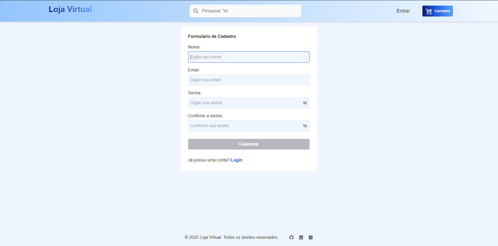

# Loja Virtual

## 📋 Descrição

Loja Virtual moderno, com recursos como cadastro de produtos, carrinho de compras e gerenciamento de pedidos, simulando uma loja virtual completa.

## 🛠️ Tecnologias

- Node.js
- JWT
- Express.js
- React.js
- MongoDB
- Tailwind CSS.

## 🌍 Acesse o projeto

Você pode acessar o projeto online clicando no link abaixo:  
👉  [em andamento...](https://loja-virtual-liedson.vercel.app)

## Imagem do projeto
   

